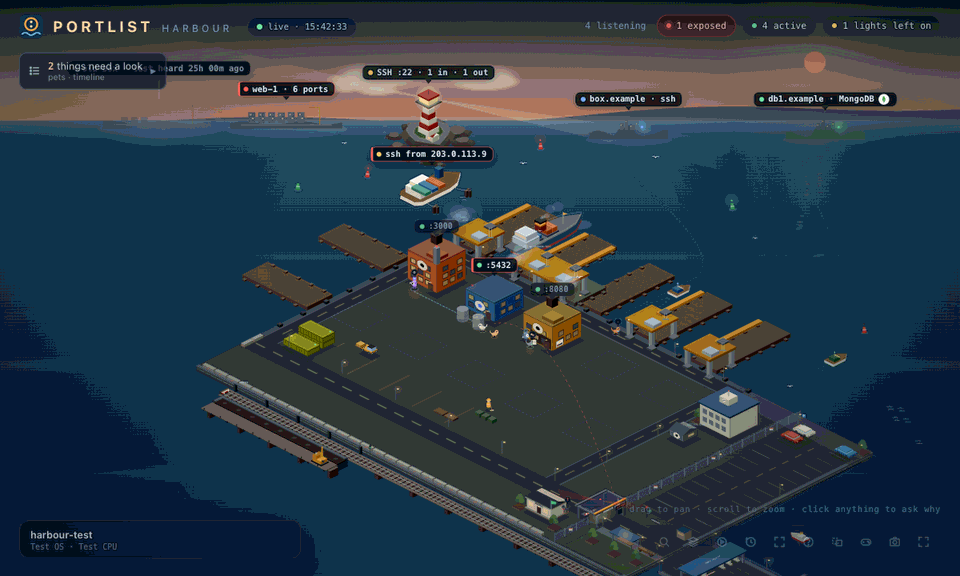

<h1 align="center">portlist</h1>

<p align="center">
  <strong>Every port on your machine. Who started it. Who can reach it. Whether you still need it.</strong><br>
  A terminal program for macOS, Linux and Windows. No dependencies.
</p>

<p align="center">
  <a href="https://mr-hunt-007.github.io/portlist/play/">Try it in your browser</a> &middot;
  <a href="https://mr-hunt-007.github.io/portlist/">Website</a> &middot;
  <a href="docs/USAGE.md">Usage</a> &middot;
  <a href="CHANGELOG.md">Changelog</a> &middot;
  <a href="LICENSE">MIT</a>
</p>

```
$ portlist
 PORTLIST  devbox   6 listening  1 off-box  1 need attention                              14:13:20
 ▌1 Services   2 Exposed   3 Attention   4 Leftovers   5 Agents   6 Containers   7 Sessions ...

 PORT    SERVICE                 PROJECT           REACHABLE      RISK     STARTED BY
 :3000   Next.js                 storefront        Localhost only 12 Info  Claude Code 2h
 :5173   Vite                    admin-ui          Localhost only 12 Info  terminal 5h
 :5432   PostgreSQL              storefront        Localhost only 12 Info  Docker 2d
 :8787   Python http.server      data-export       All interfaces 71 High  Claude Code 5d
 :11434  Ollama                  -                 Localhost only 12 Info  launchd 9d
```

`:8787` is the one to look at. Ask about it:

```
$ portlist 8787
Target       :8787
Service      Python http.server  (python3, pid 4412, user you)
Project      data-export  ~/code/data-export
Started      5d 0h ago by a Claude Code session (exited)
Why it runs  launchd (pid 1) → python3 (pid 4412)
Reachable    All interfaces  0.0.0.0
In use       0 connections now, never seen in use in 5d 0h of watching
Risk         71 High
Warnings     reachable from beyond this machine: portlist connected on 192.0.2.14 (en0) and got in
             looks left over: nothing has connected to it in the 5 days portlist has been watching
             a Claude Code session started it and has since exited
To stop it   portlist kill 8787  (or kill 4412)
```

A session that ended five days ago left a file server open to your network, and
portlist did not take the bind address's word for it: it connected from your
network address and got in. Then:

```
portlist kill 8787     # shows it, asks, stops it the right way, checks it stayed stopped
portlist cleanup       # walks every leftover with its evidence: y stop, n keep, k stop asking
portlist report        # the whole machine as one HTML file to hand on (--redact for outside)
```

`kill` knows what it is stopping. A port published by a container is stopped
with `docker stop`, not by killing the engine's proxy. A Homebrew service, a
launchd job or a systemd unit is stopped through its manager, because killing
the process only gets it restarted. After the stop portlist looks again, and if
something brought it straight back, it tells you what.

**[Try all of it in your browser](https://mr-hunt-007.github.io/portlist/play/)**: a
simulated laptop and a staging server, the real program's views, and a guided
tour. No install.

## What problem does it solve

`lsof -i` and `netstat` answer *what is bound to this port*. That was the whole
question when a machine ran two servers you started by hand. It is not the
question any more, because most of what is listening on a developer laptop was
started by something else: an agent session, an editor, a container, a service
manager, or you, on Tuesday, in a directory you have since forgotten.

The questions that are actually in the way:

| you ask | `lsof` says | portlist says |
|---|---|---|
| what is on :8787? | `Python, pid 96798` | a static file server, started by a Claude Code session, in `~/code/data-export` |
| who started it? | nothing | that session, and whether it has since exited |
| can anyone reach it? | a bind string like `0.0.0.0` | what answered when it connected to this machine's real address |
| is it still needed? | how long it has been *up* | how long it has been *unused*, measured over time |
| is it safe to kill? | nothing | what depends on it, what it depends on, and the command to stop it |

Three situations it was built for:

**"Address already in use."** Something holds :3000 and you did not start it.
Was it this morning's agent session, a container, or a dev server from last
Tuesday that never died? portlist names it, and if you just want a port that is
free now and not spoken for later, `f` gives you one.

**An agent left the lights on.** Coding agents start servers and move on. The
session exits, the server does not, and nothing on the machine remembers which
session it belonged to. portlist writes a launch record the first time it sees a
service and never rewrites it, so the answer survives both the agent exiting and
the service being restarted by something else.

**Bound to the world by accident.** `0.0.0.0` in a config file is a claim. The
only honest answer comes from connecting to this machine's real address and
seeing what answers, which is what the `REACHABLE` column is.

And the rule underneath all of it: **it never dresses a guess as a fact.** A
service that was already listening before portlist first looked has *unknown*
origin and says so, rather than inheriting a label from whatever owns the port
now. "The container engine did not answer" is never rendered as "no containers".

## Install

**Homebrew** (macOS, Linux)

```sh
brew tap Mr-hunt-007/portlist https://github.com/Mr-hunt-007/homebrew-portlist
brew trust mr-hunt-007/portlist      # Homebrew asks this of every third-party tap
brew install portlist
```

**pip or pipx**, anywhere. pipx is the simplest route on Windows, because it
brings `windows-curses` along:

```sh
pipx install git+https://github.com/Mr-hunt-007/portlist
pip  install git+https://github.com/Mr-hunt-007/portlist
```

**One line**, into `~/.local`, no root and nothing system-wide:

```sh
curl -fsSL https://mr-hunt-007.github.io/portlist/install.sh | sh
```

**From source**, which needs nothing but Python:

```sh
git clone https://github.com/Mr-hunt-007/portlist && cd portlist && python3 portlist.py
```

Then run `portlist`.

<sub>`winget install` is not available and is not coming: winget accepts only
`.exe` for a portable package, and what ships for Windows is the source plus a
`.cmd` shim, so the manifests in `packaging/winget/` cannot pass validation. Use
pipx there. The name `portlist` on PyPI belongs to an unrelated package, which
is why the distribution is `portlist-tui` while the command stays
`portlist`.</sub>

## One answer, then exit

When you already know which one you mean, name it and portlist explains it
without opening the views:

```
$ portlist 8000
Target       :8000
Service      FastAPI / Uvicorn  (Python, pid 18714, user you)
Project      ransompool  ~/code/ransompool
Started      18h 6m ago by a Claude Code session (exited)
Why it runs  launchd (pid 1) → Python (pid 18714)
Reachable    Localhost only  127.0.0.1
In use       0 connections now, never seen in use in 18h of watching
Risk         12 Info
Warnings     looks left over: nothing has connected to it in 18 hours
             a Claude Code session started it and has since exited
To stop it   portlist kill 8000  (or kill 18714)
```

```
portlist 3000              # a port (or :3000); portlist --port 3000 --port 5173 for several
portlist node              # every listener whose service, command or project matches
portlist --pid 812         # by process
portlist 3000 --short      # just the chain that started it, on one line
portlist 3000 --tree       # the chain as a tree, with what it started in turn
portlist 3000 --warnings   # only what deserves a look
portlist 3000 --json       # all of it, for scripts and agents
portlist --list            # everything listening, once; add --exposed, --leftovers or --attention
portlist --completion zsh  # shell completion for bash, zsh or fish
```

Warnings are measured facts: reachable from beyond this machine, bound beyond
loopback, high risk, running as root, an executable deleted since it started,
a library injection variable (`LD_PRELOAD`, `DYLD_INSERT_LIBRARIES`), looks
left over, its agent has exited, up more than 90 days, over 1 GB of memory,
started three or more times today. An unknown origin is not a warning: unknown
is not the same as dangerous.

The exit code says what a script needs: `0` fine, `1` warnings, `2` nothing
matched, `3` another user's process (run with sudo), `4` an unusable question,
`5` an internal error.

```sh
portlist 8787 --short
case $? in 0) echo fine ;; 1) echo "worth a look" ;; 2) echo "not running" ;; esac
```

## The dashboard

`0`, and it is where portlist opens. Everything about the machine on one screen,
so a single screenshot tells the whole story.

```
  MACHINE                                           EXPOSURE                    AGENTS                      CONTAINERS
     ·  ●  ●         ·  ●  ●         ◉  ●  ●        LISTENING      16           Claude Code    14           ENGINE         docker
   ·         ●     ·         ●     ●         ●      EXPOSED        2            terminal       1            STATE          no answer
  ·    36%    ◉   ◉    85%    ●   ●    96%    ●     NEEDS WORK     2            launchd        1                           count unknown
   ·   CPU   ·     ●   RAM   ●     ●  DISK   ●      UNKNOWN ORIGIN 12                                                      not zero
     ·  ·  ·         ●  ●  ●         ●  ●  ●
  LOAD  3.56 3.37 3.64

  LISTENING  14 services                                                                                      Tab  next section
    PORT    SERVICE               PROJECT           STARTED BY          REACH           RISK
  ● :7337   Grafana               metrics           terminal            Localhost only  12 Info
  ○ :8000   Python http.server    analytics         Claude Code         Localhost only  12 Info
  ○ :8787   Python http.server    data-export       Claude Code         All interfaces  71 High

  SELECTED SERVICE                                                          │ ACTIVITY
                                                                            │
  Grafana :7337                                                             │ 22:52:49 · Bun on :10065 stopped listening
  ~/code/metrics                                                            │ 22:23:58 · Bun opened on :57155 (loopback)
                                                                            │
  REACH      Localhost only                                                 │ CPU
  PID        9561   Python                                                  │ ▃▃▄▃▃▂▃▄▅▄▃▃▃
  LAST USED  in use now                                                     │ MEMORY
                                                                            │ ▇▇▇▇▇▇▇▇▇▇▇▇▇
  RISK  71 / 100   High                                                     │
    +42   Listening on all interfaces (0.0.0.0)                             │
    +10   No authentication seen and reachable off-box                      │

  ● 2 exposed    ◆ 2 need attention    ⚠ 12 unknown origin    ◉ 3 agents    firewall on
```

**Tab** moves to the next view, in the same order as the number keys, and
**shift-Tab** goes back. **`h`** and **`l`** (or the arrows) move between the
dashboard's panes, and `j`/`k` move inside whichever has focus.

The three dials are live: each ring is twelve segments, the leading one pulses,
and the ring eases round rather than jumping when the reading changes. An
unmeasured value draws an empty ring and says so instead of resting at zero.

Under every card and across the table runs the same travelling wave, and its
**amplitude and speed are the reading**: a quiet machine ripples slowly and
shallowly, a busy one moves faster and taller. It is a sine, not a history, and
it is never drawn where a history belongs; the sparklines plot real samples. A
card with nothing to measure draws a flat line of dots rather than a wave at
zero, because a flat wave still reads as a measurement of zero, and "not
measured" is not zero.

The risk score is never a bare number. The pane lists what it was made of, so
`71 High` is auditable rather than magical, and `⚠ 12 unknown origin` is counted
precisely so those services are not quietly attributed to whatever owns the port
now.

## Ten views

| key | view | what it answers |
|-----|------|-----------------|
| `0` | dashboard | everything at once, and where it opens |
| `1` | services | everything listening, with who started it |
| `2` | exposed | reachable from beyond this machine |
| `3` | attention | critical, high and medium risk |
| `4` | leftovers | looks abandoned, with the measurements behind the guess |
| `5` | agents | grouped by the agent, editor or terminal that started it |
| `6` | containers | by compose project, and the host ports they hold |
| `7` | sessions | coding-agent sessions, what they were about, context used |
| `8` | system | this machine: load, memory, disks, network, exposure |
| `9` | graph | who started what, where it runs, and what it exposes |
| `V` | vibe | the ambient screen, for the second monitor |

Views 5 and 6 group rather than filter. Every view is a different question asked
of one scan, not a different scan.

## Keys

```
j / k, arrows   move                    tab shift-tab   the next view, the
h / l           the dashboard's panes                   same order as 0-9
enter, o        detail pane             /   search
O               open it in a browser    f   a port that is free now, and not
                (ctrl+enter too, where      spoken for by anything later
                the terminal sends it)  a   animation      V   vibe mode
0-9             views                   r   rescan now     ?   keys    q  quit
                                        W   the living harbour, in a browser
```

macOS never delivers Cmd+Enter to a terminal program, so `O` is the binding that
always works.

## The sessions you left open

Ten agent windows, none of them closed, and no way to tell which is which.

Press **7**. Open sessions first, because those are the only rows you can act
on; everything under them is a transcript nobody is holding:

```
 TOOL     WHAT IT WAS ABOUT                    PROJECT      CONTEXT  VS BIGGEST  LAST USED
 4 agent processes running  -  30 transcripts on disk
     Claude Code      max - default max 20x
     Codex            not signed in

 6 open right now  -  2.9M tokens between them  -  oldest untouched 5h
 * claude Refactor the billing webhook retries  payments       215k  ██░░░░░░    2s ago    4 here
 * claude Port the admin table to components    admin-ui       904k  ████████    17m ago   4 here
 * claude Trace the flaky integration test      api            479k  ████░░░░    26m ago   4 here

 24 left on disk, no process behind them
   claude Split the worker into two queues      worker         935k  ████████    7h ago
   claude Make the search endpoint paginate     docs           193k  ██░░░░░░    9h ago
```

The bar compares each session with the **biggest one on this machine**, and
with nothing else. A transcript records the tokens a turn carried; it never
records the model's context limit, so portlist will not print a percentage of a
window it cannot read.

`enter` opens the rest of it - the first prompt you typed, where the session got
to, and how to close it:

```
 context       903,802 tokens on the last turn  -  214 turns
 last active   28 Aug 04:14  (17m ago)
 running       pid 14502
 close it      kill 14502
 first prompt  the stripe webhook retries twice on 5xx, work out why and fix...
 last prompt   run the migration against staging first
```

When several agents share one directory it says so instead of choosing:

```
 running       pid 9316, 5864, 30000, 43725 - more than one agent is in this
               directory, so which of them is this session cannot be told from outside
 close it      from its own window - the line above says why a pid cannot be picked for you
```

A `kill` that might close the wrong window is worse than no command at all.

Six tools, each read from the store it already writes:

| | |
|---|---|
| **Claude Code** | `~/.claude/projects/**/*.jsonl` |
| **Codex** | `~/.codex/sessions/**/rollout-*.jsonl` |
| **GitHub Copilot CLI** | `~/.copilot/session-store.db`, which keeps its own summary |
| **VS Code chat** | `.../Code/User/workspaceStorage/*/chatSessions/*.jsonl` |
| **Cursor** | the same layout under `Cursor/`, because it is a VS Code fork |
| **Gemini CLI** | `~/.gemini/tmp/*/logs.json`, where a build writes one |

Each gives the generated title, the first prompt you typed, the project, the
model, the turn count, and where available the **context it is carrying** - the
token total from the last turn, which is the number that decides what to clear.

It also shows which plan each tool is signed in under, so "which account burned
this week's quota" is answerable:

```
  Claude Code      max - default max 20x
  Codex            not signed in
  GitHub Copilot   signed in
  Gemini           signed in
```

Live sessions are matched to running agent processes by working directory. Where
several agents share one directory it says so rather than guessing.

**Prompts never leave the machine.** portlist sends nothing anywhere and has no
network code that reaches beyond this host, so there is nowhere for them to go.
(The optional harbour, `--world`, serves one page on 127.0.0.1 only, and shows
session titles, never prompts.) Account details are narrower still:
the plan and the organisation, never the address or the account id.

It never reads a whole transcript either - they reach eight megabytes. The head
has the first prompt and the directory, the tail has the title, the latest usage
and the last activity. Sixty sessions in a tenth of a second.

## The graph

`9`. Who started what, where it runs and what it exposes, laid out the way a
terminal draws a layered graph well:

```
  STARTED BY            PROJECT             PROCESS           PORT  AND SERVICE          REACHABLE FROM
  started work in ──▸   runs ──▸            listens ──▸       confirmed on ──▸

  ◆ Claude Code       ├─analytics         ──Python pid 6810 ──:8000   Python http.serv ──Localhost only
  │                   ├─data-export       ──node pid 77259  ──:8422   unidentified     ──Localhost only
  │                   │                   ──Python pid 96798──:8787   Python http.serv ──All interfaces  confirmed on 192.168.0.2
  │                   ├─metrics           ──bun pid 32016   ──:48744  Bun              ──Localhost only
  │                   └─scanner           ──Python pid 67222──:8787   FastAPI / Uvicorn──Localhost only
  ◇ launchd           └─no project        ──tor pid 58508   ──:9050   Tor              ──Localhost only

  ◆ an agent session   ◇ something else   10 of 12 services were started by an agent
```

One line is one service, and a parent is printed once and carried down with a
rule, which is what makes the sharing visible: eleven services under one agent
session, four in one project. The edge names are the ones the web version uses,
so both surfaces describe the machine with one vocabulary.

Narrow terminals get the same graph as headed groups, because that is what a
tree looks like when it runs out of width.

## The living harbour

<p align="center"></p>

```
portlist --world        # or -world, or W inside the terminal
```

Every port on this machine as a harbour, in a browser, full screen: a second
screen you can glance at. Each listening service is a building shaped by what it
is (a lighthouse for SSH, tanks for Postgres and Mongo, a dome for a local model,
a mast for MCP, and a submarine off the quay for an MCP server that speaks over stdio and holds no port at all), the gate out of the harbour opens only when portlist actually
connected from the network and got in, agents are robots that walk out when they
exit and leave a bulb burning over whatever they left running, and five cats go
and look at whatever matters most. Click anything and it says which measurement
put it there.

Loopback only, one file, no dependencies. It only reads, unless you switch on
stopping in its Play panel (off on every load, and each stop is confirmed). `--windowed` for a normal
tab, `--no-open` to print the address. What every object means, the pets' jobs
and the rules are in [docs/WORLD.md](docs/WORLD.md).

## Vibe mode

Press **V**, or leave it alone for thirty seconds:

```
                              P O R T L I S T

                                LOCAL NETWORK

                                   ○ :8787
                  :8422 ○ ·           ·           · ○ :8807
                            ·····     ·     ·····
             :8078 ○ ···················HOST···········●······ ◉ :7337
                            ·····     ·     ·····
                  :9050 ○ ·           ·           · ○ :8000

                  1 connection observed between local services
```

Seven scenes rotate: the cockpit (everything at once), a grid of every listening
service, the machine and its
meters, the network between local services, each agent and what it started,
what has actually happened lately, and **the room** - a plate that ships with
the program, drawn as characters, with the three numbers that fit placed where
it is dark. Five themes, four speeds, `t` and `s` to
cycle them, any other key to come back.

The room scene ships a picture so that it is a scene at all, but that is a
default and not a fixture: set a picture of your own and the room shows yours.
A picture of yours decorates the other six: name it on the way in with
`portlist --vibe-bg thing.png`, or drop PNGs into `~/.portlist/backgrounds/` and
press `g` inside vibe mode to walk them, with the footer naming what is showing.

`g` covers both which picture and how it is drawn:

```
none  ->  room.png as an image  ->  room.png as characters  ->  none
```

**As an image** means the terminal is handed the PNG and draws it itself, behind
the text. **As characters** is the density rendering: `b` sets how strongly it
shows, 0 to 100, and `B` decides which end of the picture becomes ink.

### Which terminal shows the real picture

Almost no terminal can draw a picture. The ones that can speak **kitty's
graphics protocol**, and portlist uses only that protocol, for one reason: it
has a z-index, and `z=-1` is the only arrangement that puts a picture *behind*
the readings. iTerm2's inline images and sixel both occupy cells, so a picture
drawn either way would cover the numbers, and a screen whose numbers are hidden
by decoration is worse than a screen with no decoration. So iTerm2 and every
sixel terminal get the character rendering too.

If the ring goes straight from `none` to *as characters*, your terminal cannot
do it. That is not a setting you are missing.

**macOS** - Terminal.app cannot, and no preference changes that. iTerm2 cannot
either, for the reason above. Install one of:

```sh
brew install --cask ghostty     # verified working, and needs no configuration
brew install --cask kitty       # the reference implementation of the protocol
brew install --cask wezterm
```

If Ghostty is the first thing you install, note that its `TERM` is
`xterm-ghostty`, which is not in the terminfo database most systems ship. Recent
versions install it for you; if portlist will not start there at all, that is
why, and this fixes it:

```sh
mkdir -p ~/.terminfo/78
cp /Applications/Ghostty.app/Contents/Resources/terminfo/78/xterm-ghostty ~/.terminfo/78/
```

**Linux** - several work. kitty and Ghostty are packaged for most distributions;
Konsole (KDE) and WezTerm implement the protocol as well.

```sh
sudo apt install kitty                 # Debian, Ubuntu
sudo dnf install kitty                 # Fedora
sudo pacman -S kitty                   # Arch
curl -L https://sw.kovidgoyal.net/kitty/installer.sh | sh /dev/stdin
```

**Windows** - Windows Terminal speaks sixel, not this protocol, so it draws
characters. **WezTerm** is the one that works:

```powershell
winget install wez.wezterm
```

Under WSL the terminal is whatever is drawing the window, so the same rule
applies: WezTerm yes, Windows Terminal characters.

**Over ssh** it works when the terminal in front of *you* supports it, because
the escape travels down the connection like any other output. **Inside tmux** it
usually does not, unless tmux is configured to pass the escape through. The
character rendering has none of these conditions, which is why it stays the
default answer rather than a fallback.

Nothing is written to a terminal that has not said it speaks the protocol, so
being wrong about support costs a blank background rather than escape codes
across your screen. To force characters everywhere, including on a terminal that
could show the file, set `PORTLIST_NO_GRAPHICS=1` or press `g` one more step.

**Confirmed on Ghostty**, macOS, with the picture behind the readings as
intended. kitty is the reference implementation of the protocol and Konsole and
WezTerm implement it too, but I have not put eyes on those three, and terminals
differ in how completely they follow the spec. If yours honours the protocol
without the z-index the picture will sit *over* the text rather than behind it:
press `g` once more for characters, and open an issue naming the terminal.

When a service really appears while you are watching, it is marked **NEW** for a
few seconds and the strip redraws around it; when one stops listening, that is
reported too. The first frame marks nothing, because everything is new to the
screen the moment it opens and none of it is new to the machine.

**Nothing on that screen moves unless something was measured.** A dot pulses
because that service was measured busy inside the last minute. A particle
crosses an edge because a loopback connection between those two ports was
observed. Where nothing has been measured, it says so and sits still: inventing
motion would make the prettiest part of the program the one lying to you.

## What it can tell you that `lsof` cannot

- **Who started it.** Claude Code, Cursor, Codex, Copilot, Gemini CLI, OpenCode,
  Aider, Goose, Windsurf, an editor, a terminal, a service manager - from process
  ancestry first and the environment second. And whether that session has since
  exited. Each agent is one file in [`plcore/adapters/`](plcore/adapters/), so
  adding the one you use is a small pull request.
- **Whether it survived a restart.** A launch record is written the first time a
  service is seen and never rewritten, so attribution outlives both the agent
  exiting and the service being restarted by something else.
- **Whether anyone is using it.** Measured over time, not inferred from uptime.
- **Whether the network can reach it**, checked by connecting to this machine's
  real address rather than reading a bind string.
- **Which container holds the port**, and which compose project it belongs to.
- **A port that is free** now and not spoken for by anything you run later.

## It stops nothing without a yes

Looking is free; stopping is asked for. `portlist kill` and `portlist cleanup`
show what a listener is before they ask, stop only what a fresh scan still shows
on that port, never touch pid 0 or 1, portlist itself, or anything it files as
part of the system, and refuse to ask a pipe: in a script, `--yes` is the only
way to act and `--dry-run` shows what would happen. The terminal views have no
kill key. The harbour's Play panel has a **stopping** switch, off on every page
load; with it on, each stop asks first and goes through the same checks.

It does open sockets, and it is worth being exact about which. It connects
*outward* to the ports on this machine to see what answers, and it binds a
candidate port for a moment to check it is free, then closes it. Neither ever
calls `listen()`, so the terminal has no port of its own and nothing can
connect to it. `portlist --world` is the only thing that listens: one server on
127.0.0.1, gone when you close it, answering only with the per-run key.

## Where its data lives

`~/.portlist/` - the launch ledger, use history and the recipe book. Override
with `--data-dir` or `PORTLIST_DATA`.

## Requirements

Python 3.9+ with `curses`, standard on macOS, Linux and BSD. On Windows,
`pip install windows-curses`, which `pipx install portlist-tui` does for you. No
third-party packages on any platform otherwise, ever.

## Documentation

- [Setup](docs/SETUP.md) - every install route, and what each one puts where
- [Usage](docs/USAGE.md) - the views, the keys, and what each column means
- [Features](docs/FEATURES.md) - the full list, and how each answer is reached
- [Architecture](docs/ARCHITECTURE.md) - one scan, one model, ten views
- [Motion](docs/MOTION.md) - the animation language, and why each thing moves
- [Security](SECURITY.md) - what it reads, what it never sends
- [Contributing](CONTRIBUTING.md)

## Contributors

<a href="https://github.com/Cipher-Sage007"></a>

**[Cipher-Sage007](https://github.com/Cipher-Sage007)**. Huge thanks and kudos
for everything behind the living harbour. 
<br clear="left">

MIT.

---

If portlist saved you an afternoon of `lsof | grep`, you can
[buy me a coffee](https://buymeacoffee.com/mr.hunt.007). Entirely optional: the
tool is free, has no telemetry, and will stay that way.
